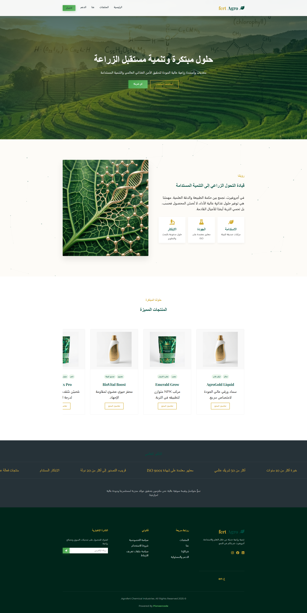

# AGROFERT — Corporate Website  [](https://opensource.org/licenses/MIT)



![Website] (https://pioneercode1.github.io/agrofert/)

A modern and responsive corporate website developed for **AGROFERT for Development and Chemical Industrial**.

The website is designed as an informative digital presence for the company, presenting its identity, products, services, and general company information through a clean and professional web interface.

## 📌 About the Project

The **AGROFERT Website** is a front-end corporate website created to introduce the company and provide visitors with clear and accessible information about its business activities.

The website focuses on:

- Introducing AGROFERT and its business activities
- Presenting the company's products
- Highlighting the services provided by the company
- Providing a professional and responsive user experience
- Organizing company information in a clear and accessible structure

## ✨ Features

- Corporate Profile — A dedicated section introducing the company and its activities.
- Products Showcase — Displays the company's products in an organized and user-friendly layout.
- Services — Presents the main services offered by AGROFERT.
- Responsive Design — Optimized for desktop, tablet, and mobile devices.
- Modern UI — Clean and professional visual design suitable for a corporate website.
- Interactive Elements — JavaScript-powered interactions and dynamic front-end behavior.
- Easy Navigation — Simple navigation structure for quick access to the main sections.

## 🛠️ Technologies Used

The project was developed using standard web technologies:

- HTML5 — Website structure and semantic content
- CSS3 — Layout, styling, responsiveness, and visual presentation
- JavaScript (ES6+) — Interactivity and client-side functionality

## 📂 Project Structure

```text
AGROFERT/
│
├── index.html
├── css/
│   └── style.css
├── js/
│   └── script.js
├── images/
│   └── ...
└── README.md
```

> The actual folder and file names may vary depending on the final project structure.

## 🎯 Project Objective

The primary objective of the project is to provide AGROFERT with a professional online presence that communicates its corporate identity, products, and services in a clear and modern way.

The website is intended to serve as an informative platform for customers, partners, and visitors who want to learn more about the company and its activities.

## 🚀 Getting Started

Since this is a front-end website, no special server-side setup is required for basic usage.

### Run Locally

1. Clone the repository:

```bash
git clone https://github.com/Pioneercode1/agrofert.git
```

2. Open the project folder.
3. Open `index.html` in your web browser.

For development, the project can also be opened using Visual Studio Code with a local development server such as Live Server.

## 📱 Responsive Design

The website is designed with responsive layouts to provide a consistent browsing experience across:

- Desktop computers
- Laptops
- Tablets
- Mobile devices

## 🔧 Future Improvements

Possible future enhancements include:

- Adding a dedicated contact form
- Integrating a backend or CMS
- Adding product search and filtering
- Adding multilingual support
- Connecting the website to a database
- Improving SEO and accessibility
- Adding an administration dashboard for managing products and company content

## 📄 License

[](LICENSE)
This project is licensed under the MIT License.
The MIT License permits use, copying, modification, merging, publishing, distribution, sublicensing, and selling of copies of the software, subject to the terms and conditions of the license.

This project is a corporate website developed for AGROFERT for Development and Chemical Industrial.
All company-related content, branding, logos, product information, and other proprietary materials remain the property of their respective owners.

---

AGROFERT — For Development and Chemical Industrial
